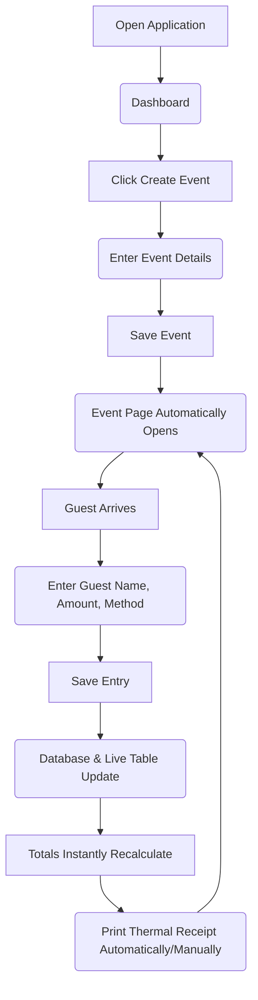
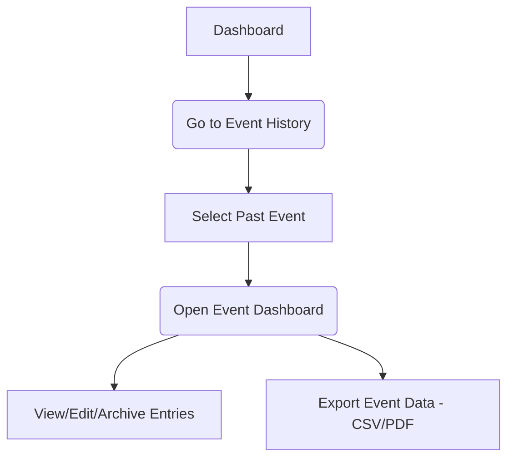
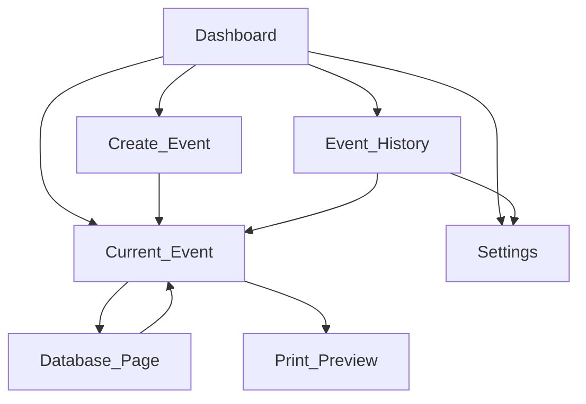
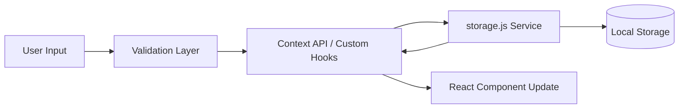

# Happy Pocket: Software Architecture & Application Flow

## 1. User Journey

### Core Flow: Hosting a new event


### Secondary Flow: Managing Past Events


---

## 2. Navigation Flow


> [!NOTE] 
> The **Sidebar** is persistent holding links to Dashboard, Active Event, Database (of active event), History, and Settings.

---

## 3. Data Flow

### Event & Entry Creation



### Dashboard Statistics
1. Dashboard mounts.
2. `useTotals()` hook requests data from `storage.js`.
3. `storage.js` reads `events` and `entries` from Local Storage.
4. Calculations are run (Total Collected, Today's Collection).
5. State is updated; UI renders.

---

## 4. Event Lifecycle

1. **Initialization:** User enters details `->` `storage.js` creates a unique UUID `->` event saved to DB.
2. **Active Phase:** Event is marked as the "Current Event". All new entries are tagged with this Event's UUID.
3. **Modification Phase:** Entries are added, edited, or deleted. Totals fluctuate in real-time.
4. **Archival Phase:** When a new event is created, the active event loses "current" status but remains in `Event History`.
5. **Deletion (Optional):** Deleting an event cascades, meaning `storage.js` drops the event AND all identically tagged entries.

---

## 5. Receipt Lifecycle

### Generation Engine
* **Rule:** Auto-incrementing, collision-proof integer strings (e.g., `0001`, `0002`).
* **Generation Timing:** A receipt number is generated *only at the exact moment* of Saving an Entry to prevent gaps if a user abandons a form.
* **Relationship:** Receipt numbers are isolated per Event. Event A has receipts #1-50, Event B starts back at #1. (Can be overridden in Settings).
* **Reset Rules:** Standard is resetting to `0001` per event.
* **Firebase Readiness:** Generated numbers are checked against local arrays now, but easily adapt to optimistic concurrency control (transactions) in Firebase.

---

## 6. Validation Flow

**Rule:** UI responds with inline error text beneath inputs. Red borders highlight the offending input.

* **Empty Name:** "Name is required." Focus stays on name input.
* **Invalid/Negative Amount:** "Amount must be greater than 0." Submit disabled.
* **Duplicate Receipt (if manually edited):** "Receipt # already exists for this event."
* **Invalid Payment Method:** "Please select a valid payment method."
* **Future Date:** UI date picker disables future dates by default.

---

## 7. Storage Architecture

`services/storage.js` will act as an interface for the `localStorage` API. 

### JSON Schema
```json
{
  "settings": {
    "businessName": "Happy Pocket",
    "receiptPrefix": "Moi-",
    "currency": "₹",
    "paperWidth": "58mm",
    "theme": "light"
  },
  "events": [
    {
      "id": "evt_abc123",
      "eventName": "John & Jane Wedding",
      "brideName": "Jane",
      "groomName": "John",
      "venue": "Grand Hall",
      "functionDate": "2026-07-01",
      "totalAmount": 55000,
      "totalEntries": 45,
      "createdAt": "2026-06-30T10:00:00Z"
    }
  ],
  "entries": [
    {
      "id": "ent_xyz789",
      "eventId": "evt_abc123",
      "receiptNumber": "0001",
      "name": "Uncle Bob",
      "amount": 5000,
      "paymentMethod": "UPI",
      "date": "2026-07-01",
      "time": "10:30:00",
      "createdAt": "2026-07-01T10:30:00Z"
    }
  ]
}
```
**Architecture Note:** We are using **Flat Relational Data** (Entries contain `eventId`) rather than nesting entries inside events. This mirrors realistic NoSQL (Firebase) structures.

---

## 8. Component Communication

* **Providers:** `EventProvider` wraps the app, holding the `activeEvent` ID.
* **Hooks:** A component like `EntryForm` calls `addEntry(data)` from `useEntries()`.
* **Services:** `useEntries()` doesn't talk to `localStorage` directly. It calls `StorageService.insertEntry(data)`.
* **State Sync:** Modifying data in `StorageService` triggers a custom event or context update, telling the `DashboardStats` component to re-render without manual prop-drilling.

---

## 9. Future Firebase Migration Plan

Because of the architectural separation, moving to Firebase requires **zero changes** to React UI components.

1. Create `services/firebaseStorage.js`.
2. Rewrite the implementations for `getEvents()`, `insertEntry()`, etc., using Firebase SDK. 
3. The function signatures remain identical (e.g., returning Promises).
4. Update imports in the custom hooks to point to `firebaseStorage.js` instead of `storage.js`.

---

## 10. Performance Strategy

* **Memoization:** Wrap expensive components (like the massive Data Grid in the Database view) in `React.memo` to prevent re-renders when someone types in the Entry Form.
* **Lazy Loading:** `React.lazy` for routes. The Database page and Settings page won't load until navigated to.
* **Search Optimization:** Debounce the search input (300ms) so filtering hundreds of entries doesn't lag the UI per keystroke.
* **Virtualization:** (Optional depending on load) If an event exceeds 1,000 entries, implement windowing/virtualization for the Database table to render only visible rows.

---

## 11. Security Considerations

* **Data Corruption:** `storage.js` uses try/catch blocks for all `JSON.parse()` actions. If parsing fails, it safely falls back to empty arrays rather than crashing the app.
* **Input Sanitization:** Strip HTML tags from text inputs to prevent XSS (important if migrating to Firebase later).
* **Backup Strategy:** The settings page forces the download of the entire JSON state as a `.json` file.
* **Restore Strategy:** Hard-validates uploaded JSON structure before applying to Local Storage to prevent breaking the app.

---

## 12. Error Recovery

* **Storage Full (5MB limit in browsers):** App gracefully displays an alert: "Local storage limit reached. Please backup and clear old events."
* **Browser Refreshes:** Because all UI state is derived from `storage.js` (which is persistent), refreshing the page instantly reloads exactly where the user left off.
* **Invalid Backup File:** Shows clear error stating "Invalid File Format. Please upload a Happy Pocket backup."
* **Printing Fails:** The receipt data is already safely stored in DB before the print dialogue opens. The user can manually click "Print" on the entry in the table.
* **Accidental Event Deletion:** Require a typed confirmation (e.g., "Type DELETE to confirm") to prevent accidental nuking of data.

---

## 13. Development Roadmap

We will build independently testable modules:

- [ ] **Milestone 1:** Architecture & Layout
  - Initialize Vite + Tailwind + Router. Scaffold folders. Create unified app layout (Sidebar + Header).
- [ ] **Milestone 2:** Storage Service & Settings
  - Build `storage.js`. Build Settings page (Theme, Currency). Build JSON Export/Import.
- [ ] **Milestone 3:** Event Management
  - Build Create Event form. Build Event History grid. Establish Context API for active events.
- [ ] **Milestone 4:** The Core Engine (Current Event)
  - Build Entry form. Build live dashboard metrics. Build local table view.
- [ ] **Milestone 5:** The Database Module
  - Build the intensive full-data grid. Implement search, filtering, and pagination.
- [ ] **Milestone 6:** Print & Polish
  - Build the React-to-print Thermal layouts (58mm/80mm). Final UI pass.
